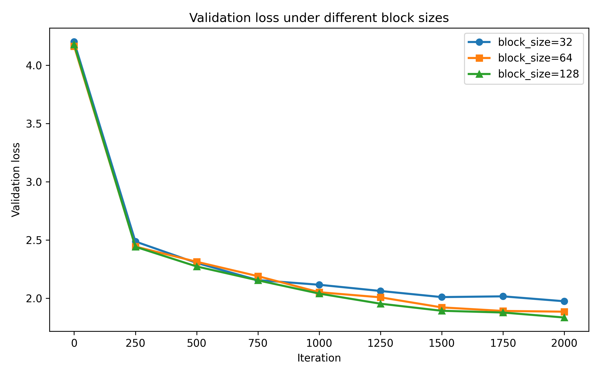
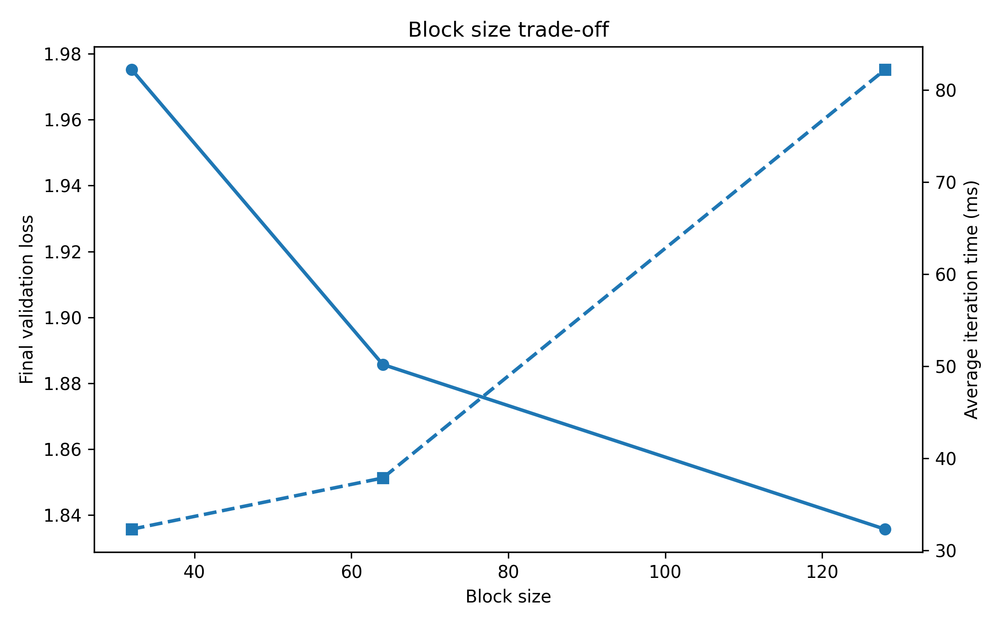
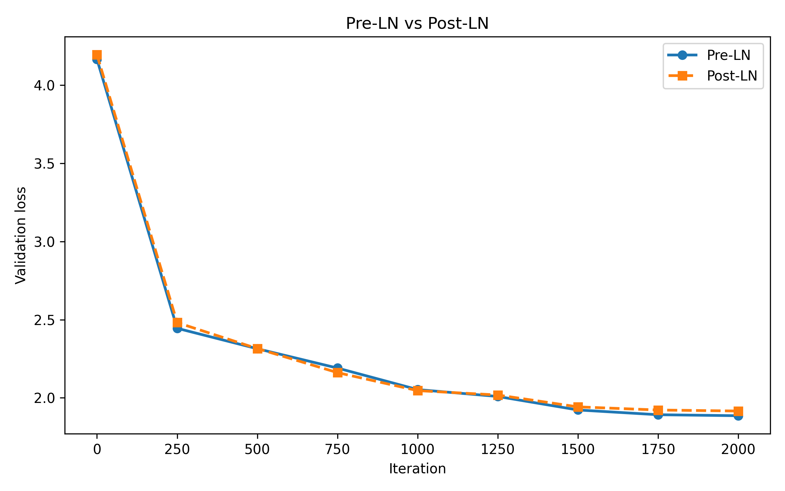
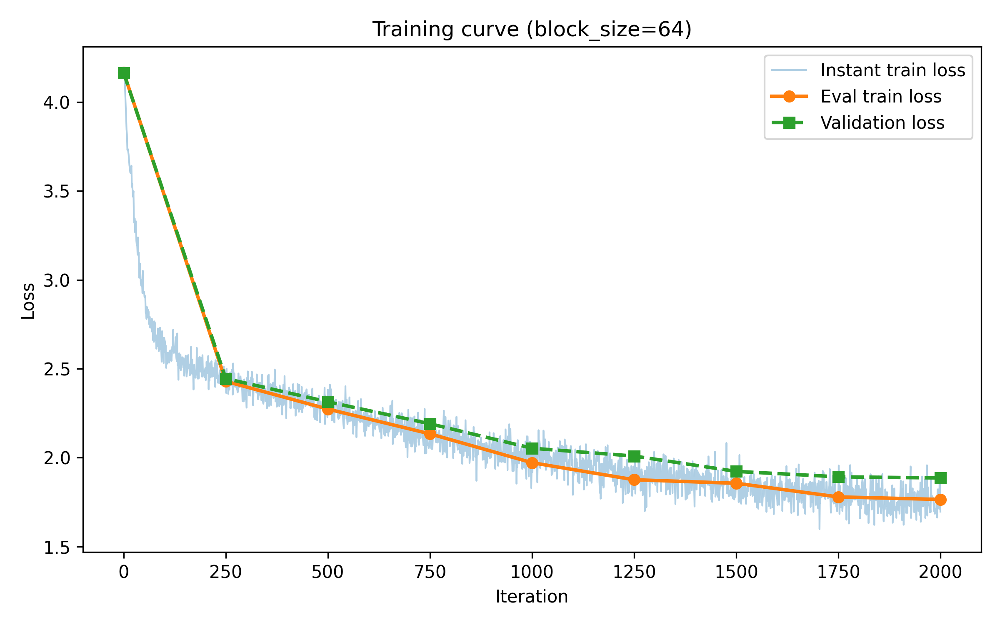

# nanoGPT Shakespeare Experiments

> A compact research-style repository for text generation reproduction, block size ablation, and normalization comparison on Shakespeare character-level modeling.

> Final experiment project for my **Natural Language Processing** course during the **first semester of my junior year**.


## Overview
This repository reproduces a lightweight nanoGPT training pipeline on the Tiny Shakespeare dataset and extends it with two controlled studies:
1. block size ablation (`32 / 64 / 128`)
2. Pre-LN vs Post-LN comparison

## Key Results
- Best final validation loss: `1.8357` at `block_size=128`
- Pre-LN final validation loss: `1.8857`
- Post-LN final validation loss: `1.9157`

A compact **research-style adaptation of nanoGPT** for character-level Shakespeare text generation, extended with two focused experiments:

1. **Context-length ablation** with `block_size = 32 / 64 / 128`
2. **Normalization comparison** between **Pre-LN** and **Post-LN**

The repository is designed to be lightweight, readable, and easy to reproduce on a CPU-friendly setup.

## Highlights

- Reproduces an end-to-end nanoGPT training pipeline on **Tiny Shakespeare**
- Uses a compact model setting (`n_layer=4`, `n_head=4`, `n_embd=128`) for practical local experimentation
- Includes **raw logs**, **summary tables**, **clean figures**, and **reproducible configs**
- Separates the project into baseline, block-size study, and normalization study
- Keeps the code close to the original nanoGPT style while exposing experimental changes clearly

## Repository Layout

```text
.
├── assets/                    # hero image for the repository homepage
├── config/                    # reproducible experiment configs
├── data/shakespeare_char/     # dataset preparation script
├── docs/                      # course report copy
├── results/
│   ├── figures/               # generated plots for README / paper-style presentation
│   ├── logs/                  # raw training logs
│   ├── block_size_summary.csv
│   ├── normalization_summary.csv
│   └── summary.json
├── scripts/                   # plotting utilities
├── train.py                   # baseline training entry
├── train_Pre-LN.py            # Pre-LN variant training
├── train_Post-LN.py           # Post-LN variant training
├── model.py                   # baseline GPT implementation
├── model_PreLN.py             # Pre-LN model definition
├── model_PostLN.py            # Post-LN model definition
├── sample.py                  # text generation
└── configurator.py            # command-line config override helper
```

## Experimental Setup

### Dataset
- **Tiny Shakespeare**
- Character-level language modeling
- Prepared via `data/shakespeare_char/prepare.py`

### Baseline Model
- `n_layer = 4`
- `n_head = 4`
- `n_embd = 128`
- `batch_size = 12`
- `max_iters = 2000`
- CPU-friendly setting for reproducibility

## Main Results

### 1) Block Size Ablation

| block_size | tokens/iter | final train loss | final val loss | avg iter time (ms) |
|---:|---:|---:|---:|---:|
| 32  | 384  | 1.8483 | 1.9752 | 32.31 |
| 64  | 768  | 1.7648 | 1.8857 | 37.87 |
| 128 | 1536 | 1.6790 | 1.8357 | 82.21 |

**Observation.** Larger context windows reduce final validation loss, but the runtime cost rises sharply.  
For this project, `block_size=64` is a strong compromise between convergence quality and efficiency, while `block_size=128` gives the best loss.

<p align="center">
  
</p>

<p align="center">
  
</p>

### 2) Pre-LN vs Post-LN

| variant | tokens/iter | final train loss | final val loss | avg iter time (ms) |
|---|---:|---:|---:|---:|
| Pre-LN  | 768 | 1.7648 | 1.8857 | 99.25 |
| Post-LN | 768 | 1.8093 | 1.9157 | 88.74 |

**Observation.** In this small-scale setup, **Pre-LN** converges to a slightly better final validation loss than **Post-LN**, and its curve is visually smoother in the logged evaluation points.

<p align="center">
  
</p>

### Baseline Training Curve

<p align="center">
  
</p>

## Quick Start

### 1. Install dependencies

```bash
pip install -r requirements.txt
```

### 2. Prepare the dataset

```bash
python data/shakespeare_char/prepare.py
```

### 3. Train the baseline model

```bash
python train.py config/train_shakespeare_char.py
```

### 4. Sample from a trained checkpoint

```bash
python sample.py --out_dir=out-shakespeare-char --device=cpu --compile=False
```

## Reproduce the Experiments

### Block size study

```bash
python train.py config/train_bs32.py
python train.py config/train_bs64.py
python train.py config/train_bs128.py
```

### Normalization study

```bash
python train_Pre-LN.py config/train_preln.py
python train_Post-LN.py config/train_postln.py
```

### Regenerate the figures

```bash
python scripts/plot_loss.py
python scripts/plot_blocksize_summary.py
python scripts/plot_preln_postln.py
```

## What Was Changed Relative to the Upstream nanoGPT Repository?

This project keeps the original nanoGPT structure but introduces a more course-project / research-report oriented organization:

- lighter CPU-oriented config for local training,
- explicit experimental branches for **Pre-LN** and **Post-LN**,
- reproducible config files for all comparisons,
- saved raw logs and cleaned figures under `results/`,
- a README written as a compact project homepage instead of a generic code dump.

## Notes

- The baseline `block_size=64` run corresponds to the main log stored in `results/logs/loss_bs64.txt`.
- The repository does **not** bundle generated dataset binaries or model checkpoints by default.
- If you want to publish this repository on GitHub, replace the placeholder repository URL in `CITATION.cff`.

## Acknowledgements

This repository is based on **nanoGPT** and keeps the original MIT license.  
See [ACKNOWLEDGEMENTS.md](ACKNOWLEDGEMENTS.md) and [LICENSE](LICENSE) for details.
